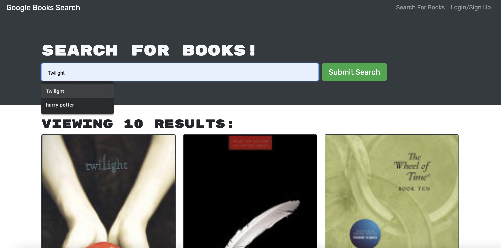

# Book Search Engine

  

  ## Description
  This application began as a RESTful API has been refactored using GraphQL API and the Apollo Server. A MERN stack, React, and MongoDB were the most notable technologies in the creation of the Book Search Engine.

  ## Table of Contents
  * [Installation](#installation)
  * [Usage](#usage)
  * [License](#license)
  * [Contact](#contact)

  ## Installation
  After cloning the repository, run "npm install" in the terminal followed by "npm start" to run the application locally. To view live application, click here.

  ## Usage
  Run the application live or locally to find books of your choosing. Use the search bar to find books. Create an account or sign in with an existing account to continue to search but also save and delete books from your favorites list.

  

  ## License
  License for this project: [MIT License](https://choosealicense.com/licenses/mit/)

  ## Contact
  With any questions or concerns, please contact me via GitHub at [cianfich1016](https://github.com/cianfich1016) or by email at cianfich@gmail.com.
